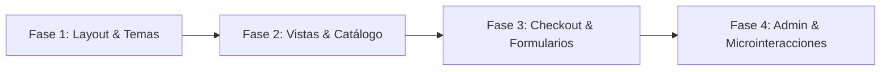

# Roadmap de Modernización UI/UX: Ferretería IA (Angular 22 + PrimeNG 22)

> **Documento de Auditoría y Plan Maestro de Experiencia de Usuario**  
> **Alcance:** Exclusivamente estético, maquetación, arquitectura de componentes de interfaz y experiencia de usuario (UI/UX).  
> **Regla Inmutable:** Las firmas públicas de los servicios HTTP, modelos de datos TypeScript y contratos con la API REST de Spring Boot se mantienen 100% intactos.

---

## 1. Diagnóstico Actual

### 1.1 Estado de la Interfaz y Deuda Técnica de Estilos

* **Arquitectura de estilos híbrida y acoplada:**
  El archivo [`frontend/src/styles.scss`](file:///home/alexis/Documentos/e-commerce-ai/frontend/src/styles.scss) contiene una base de tokens manuales denominados *"Repara.ai"* (`--bg-primary`, `--accent-electric`, `--border-subtle`, etc.) conviviendo con reglas globales que usan directivas `!important` para sobreescribir clases internas de PrimeNG (`.p-button`, `.p-dialog`, `.p-drawer`, `.p-inputtext`). Este enfoque genera fragilidad en cascada y rompe la arquitectura nativa de diseño de PrimeNG 22.
* **Uso de directivas legadas en lugar de componentes:**
  A lo largo de los templates (`header`, `checkout`, `admin`, `producto-detalle`), se implementan directivas HTML como `<button pButton>` e `<input pInputText>` en vez de los componentes modernos de PrimeNG (`<p-button>`, `<p-inputtext>`), perdiendo soporte nativo de variantes, slots de íconos, accesibilidad ARIA out-of-the-box y binding de propiedades directas.
* **Componentes huérfanos y "reinvención de la rueda":**
  * **Sistemas de pestañas (Tabs) caseros:** Tanto en [`admin.component.html`](file:///home/alexis/Documentos/e-commerce-ai/frontend/src/app/features/admin/admin.component.html#L10-L48) como en [`auth-modal.component.html`](file:///home/alexis/Documentos/e-commerce-ai/frontend/src/app/shared/components/auth-modal/auth-modal.component.html#L16-L37) se construyeron barras de pestañas con etiquetas `<button class="tab-btn">` y estilos CSS dedicados, omitiendo `<p-tabs>` / `<p-tablist>`.
  * **Tabla HTML no interactiva en Admin:** En [`admin.component.html`](file:///home/alexis/Documentos/e-commerce-ai/frontend/src/app/features/admin/admin.component.html#L92-L170), el inventario se renderiza mediante un elemento nativo `<table>` con estilos personalizados, careciendo de paginador, ordenamiento por columnas, filtrado en tiempo real y virtual scrolling presentes en `<p-table>`.
  * **Stepper manual en Checkout:** En [`checkout.component.html`](file:///home/alexis/Documentos/e-commerce-ai/frontend/src/app/features/checkout/checkout.component.html#L10-L30), el flujo de pasos (Resumen → Datos → Entrega → Pago) está maquetado mediante una lista `<ol class="stepper-list">` con lógica manual de estado activo/completado, en lugar de utilizar el componente `<p-stepper>` de PrimeNG.
  * **Controles de formulario nativos desalineados:** Se utilizan elementos `<select class="form-select">`, `<input type="checkbox">` y radio buttons customizados con CSS para la selección de método de entrega y términos, careciendo de los estados visuales consistentes que brindan `<p-select>`, `<p-checkbox>` y `<p-radiobutton>`.
  * **Selectores de cantidad (Steppers) duplicados:** Se implementaron botones `+` y `-` independientes con spans numéricos en el carrito drawer, en el detalle de producto y en el checkout, en lugar de centralizar en `<p-inputnumber [showButtons]="true">`.
  * **Puntajes de calificación (Stars Rating) artesanales:** En `product-card` y `producto-detalle` se simulan estrellas con bucles `@for (star of [1,2,3,4,5])` y clases de PrimeIcons, en lugar de adoptar `<p-rating [readonly]="true">`.
  * **Barras de distribución de reseñas manuales:** Se crearon barras con divs porcentuales inline (`[style.width.%]="dist.porcentaje"`) en vez de componentes como `<p-progressbar>`.

---

### 1.2 Puntos Críticos de UX (Visuales, Espaciado y Accesibilidad)

* **Dispersión cromática y contraste:**
  En archivos como [`product-card.component.scss`](file:///home/alexis/Documentos/e-commerce-ai/frontend/src/app/shared/components/product-card/product-card.component.scss), se observan valores hexadecimales hardcodeados (`#64748B`, `#94A3B8`, `#334155`, `#CBD5E1`, `#F59E0B`, `#E11D48`, `#047857`) sin sincronía con el sistema de tokens globales. Varios textos secundarios y etiquetas de SKU tienen ratios de contraste inferiores a 4.5:1 sobre fondo claro, lo que dificulta la lectura a usuarios con baja agudeza visual.
* **Jerarquía tipográfica y legibilidad:**
  Se mezclan estilos de títulos con diferentes pesos de fuente (`font-weight: 500`, `600`, `700`) sin una escala modular definida. Los precios combinan tamaños variables sin un criterio consistente entre la card del catálogo, el showcase de producto y el resumen de compra.
* **Layouts y comportamiento responsivo:**
  * **Header en pantallas móviles:** Oculta el tagline institucional pero satura la barra de acciones cuando el usuario está autenticado, sin un menú hamburguesa o navegación colapsable accesible.
  * **Panel de administración en dispositivos compactos:** La tabla de inventario produce desbordamiento horizontal (`overflow-x`) sin un envoltorio con scroll responsivo ni transformación a tarjetas.
  * **Layout asimétrico de resultados (40% / 60%):** En pantallas medianas (tablets entre 768px y 1024px), la columna de diagnóstico técnico y la grilla de productos se comprimen excesivamente antes de saltar a columna única.
  * **Sidebar sticky en Checkout:** En vistas intermedias, la barra lateral de resumen compite visualmente con los formularios de datos y despacho.

---

### 1.3 Estados de Carga, Estados Vacíos y Feedback al Usuario

* **Estados de carga (Skeletons / Spinners) fragmentados:**
  * [`search-skeleton.component.html`](file:///home/alexis/Documentos/e-commerce-ai/frontend/src/app/features/home/components/search-skeleton/search-skeleton.component.html) utiliza apropiadamente `<p-skeleton>`, pero [`producto-detalle.component.html`](file:///home/alexis/Documentos/e-commerce-ai/frontend/src/app/features/producto-detalle/producto-detalle.component.html#L23-L31) implementa divs con fondos grises planos y animación shimmer básica en CSS.
  * En los botones con proceso asíncrono, algunos implementan íconos `<i class="pi pi-spin pi-spinner">` embebidos manualmente en el template en lugar de utilizar la propiedad nativa `[loading]` de PrimeNG.
* **Estados vacíos (Empty States) sin patrón unificado:**
  Existen al menos cuatro maquetaciones distintas de estado vacío: `.cart-empty-state` (drawer), `.empty-card` (checkout), `.empty-state` (product-grid) y `.empty-table-cell` (admin). Falta un componente o patrón unificado que transmita calidez, confianza y una llamada a la acción (CTA) clara.
* **Feedback al usuario (Toasts vs. Banners inline):**
  * **Ausencia de notificaciones Toast:** No existen `<p-toast>` ni `MessageService` configurados en [`app.config.ts`](file:///home/alexis/Documentos/e-commerce-ai/frontend/src/app/app.config.ts) ni en [`app.component.html`](file:///home/alexis/Documentos/e-commerce-ai/frontend/src/app/app.component.html).
  * **Banners de error estáticos:** Los mensajes de error o éxito se muestran como cajas fijas en el layout (`.alert-box`, `.checkout-error-banner`, `.alert-banner`), empujando el contenido verticalmente y requiriendo interacción manual para desaparecer.
  * **Falta de confirmaciones modales:** Acciones críticas como eliminar productos o categorías en el panel de administración o vaciar el carrito carecen de un `<p-confirmdialog>` con `ConfirmationService`, ejecutándose de forma inmediata o dependiendo de alertas nativas del navegador.

---

## 2. Estándares Visuales para Angular 22 + PrimeNG 22

### 2.1 Configuración de Temas Modernos con `@primeng/themes`

PrimeNG 22 abandona definitivamente los archivos CSS de temas precompilados en favor de una arquitectura basada en **Design Tokens**, manejada a través del paquete `@primeng/themes`.

#### Lineamientos de Arquitectura de Temas:
1. **Preset Semántico Personalizado:**
   Configurar un preset derivado de **Aura** mediante la función `definePreset` en [`app.config.ts`](file:///home/alexis/Documentos/e-commerce-ai/frontend/src/app/app.config.ts), vinculando la identidad de la tienda ("Ferretería IA"):
   * **Color Primario (Electric Blue):** Escala tonal basada en `#2454FF` (50: `#eef2ff`, ..., 500: `#2454ff`, 600: `#1b44dc`, 700: `#1637b8`).
   * **Superficies (Warm Neutral Editorial):** Fondo base cálido `#FAFAF8`, superficies elevadas `#F4F3EF` y bordes sutiles `#E5E3DD`.
   * **Feedback Semántico:** Success (`#0F5132` / `#10B981`), Danger/Error (`#B02A37` / `#EF4444`), Warning (`#F59E0B`), Info (`#2454FF`).
2. **Erradicación de `!important`:**
   Sustituir las sobreescrituras en `styles.scss` por el ajuste de variables CSS generadas por PrimeNG (`--p-primary-color`, `--p-surface-ground`, `--p-content-border-radius`, `--p-button-border-radius`).
3. **Modo Claro / Oscuro Estable:**
   Definir explícitamente `darkModeSelector: 'none'` o gestionar el switch mediante tokens semánticos normalizados, evitando inconsistencias de contraste.

```typescript
// Ejemplo de configuración canónica en app.config.ts
import { providePrimeNG } from 'primeng/config';
import Aura from '@primeng/themes/aura';
import { definePreset } from '@primeng/themes';

const FerreteriaPreset = definePreset(Aura, {
  semantic: {
    primary: {
      50: '#eef2ff',
      100: '#e0e7ff',
      200: '#c7d2fe',
      300: '#a5b4fc',
      400: '#818cf8',
      500: '#2454ff',
      600: '#1b44dc',
      700: '#1637b8',
      800: '#132e96',
      900: '#102575',
      950: '#0a1647'
    },
    colorScheme: {
      light: {
        surface: {
          0: '#ffffff',
          50: '#fafaf8',
          100: '#f4f3ef',
          200: '#e5e3dd',
          300: '#d5d2c8',
          400: '#a8a497',
          500: '#737064',
          600: '#524f46',
          700: '#383630',
          800: '#23221e',
          900: '#141311',
          950: '#0a0a08'
        }
      }
    }
  }
});
```

---

### 2.2 Catálogo de Componentes PrimeNG 22 Idóneos

| Área de la Aplicación | Elemento Actual | Componente PrimeNG 22 Idóneo | Beneficios Clave |
| :--- | :--- | :--- | :--- |
| **Botones Globales** | `<button pButton>` / `.p-button-*` | `<p-button>` | Soporte de `variant="outlined"`, `severity`, gestión automática de `[loading]`, badges integrados y accesibilidad. |
| **Tarjetas & Contenedores** | `<article class="repara-card">` | `<p-card>` | Estructura modular (header, title, subtitle, content, footer), bordes y sombras controlados por tokens. |
| **Navegación por Pestañas** | `<nav class="admin-nav-tabs">` | `<p-tabs>`, `<p-tablist>`, `<p-tab>`, `<p-tabpanels>`, `<p-tabpanel>` | Modelo moderno de PrimeNG 22, transiciones fluidas y navegación por teclado (flechas). |
| **Tabla de Inventario** | `<table class="admin-table">` | `<p-table [value]="..." [paginator]="true" [rows]="10">` | Paginador reactivo, ordenamiento ascendente/descendente, filtrado global y `responsiveLayout="scroll"`. |
| **Flujo de Compra** | `<ol class="stepper-list">` | `<p-stepper>`, `<p-step-panels>`, `<p-step-item>` | Flujo paso a paso con validación de avance y animación integrada. |
| **Feedback Global** | `.alert-box`, `.alert-banner` | `<p-toast>` (con `MessageService`) | Notificaciones flotantes no invasivas con tiempos de espera configurables y niveles de severidad. |
| **Confirmaciones** | `confirm()` / botones directos | `<p-confirmdialog>` (con `ConfirmationService`) | Modales consistentes para confirmar acciones destructivas (eliminar producto, vaciar carrito). |
| **Controles Numéricos** | Steppers caseros (`+` / `-`) | `<p-inputnumber [showButtons]="true" [min]="1">` | Control unificado de stock y cantidades, soporte de flechas del teclado y límites máximos/mínimos. |
| **Entradas de Contraseña** | `<input type="password">` | `<p-password [toggleMask]="true">` | Visibilidad de contraseña alternable y medidor de complejidad en el registro. |
| **Selectores de Opciones** | `<select class="form-select">` | `<p-select>` | Reemplazo moderno de `p-dropdown`, soporte de filtrado, búsqueda integrada y estilos de token. |
| **Calificaciones** | Bucles `@for (star of ...)` | `<p-rating [readonly]="true" [cancel]="false">` | Representación vectorial limpia de estrellas con accesibilidad de sólo lectura. |
| **Badges y Etiquetas** | `.badge-stock`, `.badge-neutral` | `<p-tag>` / `<p-badge>` | Severidades semánticas (`success`, `info`, `warn`, `danger`), formas redondeadas estándar. |
| **Skeletons de Carga** | Divs `.skeleton-box` en CSS | `<p-skeleton>` | Efecto shimmer uniforme en catálogo, detalle de producto y búsqueda. |

---

### 2.3 Patrones Signal-First y Zoneless en la Capa de Presentación

1. **ChangeDetectionStrategy.OnPush:**
   Todos los componentes standalone deben migrar explícitamente a `ChangeDetectionStrategy.OnPush` (resolviendo el valor anómalo `ChangeDetectionStrategy.Eager` actualmente presente en [`app.component.ts`](file:///home/alexis/Documentos/e-commerce-ai/frontend/src/app/app.component.ts#L11) y [`home.component.ts`](file:///home/alexis/Documentos/e-commerce-ai/frontend/src/app/features/home/home.component.ts#L28)).
2. **Arquitectura Zoneless:**
   Angular 22 ofrece soporte maduro para ejecución Zoneless mediante `provideZonelessChangeDetection()`. La interfaz debe apoyarse en reactividad granular impulsada por Signals para notificar cambios de estado a la vista sin depender de los ciclos globales de Zone.js.
3. **Manejo Reactivo Puro de UI:**
   * Estados locales de interfaz (visibilidad de modales, paso activo del stepper, filtro de texto efímero) gestionados mediante `signal()`.
   * Transformaciones de presentación (conteo de ítems, totales calculados, deshabilitación condicional de botones) computadas de manera pura mediante `computed()`.
   * Vinculación con servicios: Los componentes consumen los Signals ya expuestos en `AsistenteService`, `CarritoService`, `CatalogoService`, `PedidoService`, `AuthService` y `AdminService` **sin mutar sus estructuras internas**.

---

## 3. Plan de Ejecución Paso a Paso



---

### FASE 1: Layout Global, Navbar, Sistema de Temas y Feedback Central
**Objetivo:** Establecer los cimientos visuales con PrimeNG 22, erradicar overrides forzados y proveer la infraestructura global de notificaciones y modales.

#### Componentes y Vistas a Intervenir:
* [`frontend/src/app/app.config.ts`](file:///home/alexis/Documentos/e-commerce-ai/frontend/src/app/app.config.ts)
* [`frontend/src/styles.scss`](file:///home/alexis/Documentos/e-commerce-ai/frontend/src/styles.scss)
* [`frontend/src/app/app.component.html`](file:///home/alexis/Documentos/e-commerce-ai/frontend/src/app/app.component.html) y [`app.component.ts`](file:///home/alexis/Documentos/e-commerce-ai/frontend/src/app/app.component.ts)
* [`frontend/src/app/shared/components/header/`](file:///home/alexis/Documentos/e-commerce-ai/frontend/src/app/shared/components/header/)
* [`frontend/src/app/shared/components/cart-drawer/`](file:///home/alexis/Documentos/e-commerce-ai/frontend/src/app/shared/components/cart-drawer/)
* [`frontend/src/app/shared/components/auth-modal/`](file:///home/alexis/Documentos/e-commerce-ai/frontend/src/app/shared/components/auth-modal/)

#### Componentes de PrimeNG a Integrar/Reemplazar:
* `providePrimeNG` con preset semántico personalizado sobre `Aura` en `app.config.ts`.
* Inyección de `MessageService` y `ConfirmationService` en providers.
* Integración de `<p-toast>` y `<p-confirmdialog>` a nivel raíz en `AppComponent`.
* En `HeaderComponent`: Reemplazo de `<button pButton>` por `<p-button>`, badge de carrito con `<p-badge>` reactivo y optimización de layout responsive.
* En `CartDrawerComponent`: Estandarización de `<p-drawer>`, control de cantidad con `<p-inputnumber [showButtons]="true">`, botones primarios y de vaciado con `<p-button>`, confirmación con `ConfirmationService`.
* En `AuthModalComponent`: `<p-dialog>` con `<p-tabs>` para navegación entre Login y Registro, campos de contraseña con `<p-password [toggleMask]="true">`, reemplazo de alertas fijas por `<p-message>` y feedback toast.

#### Criterios de Aceptación Visual:
1. La barra de navegación se adapta fluidamente a pantallas móviles, tablets y monitores de escritorio sin desbordamientos ni saltos visuales.
2. No existe ninguna directiva `!important` en `styles.scss` para alterar componentes de PrimeNG.
3. El agregar un producto, vaciar el carrito o fallar en el login dispara una notificación `<p-toast>` flotante con diseño acorde a la identidad corporativa.
4. Las contraseñas en el modal de autenticación cuentan con botón de visualización accesible (ojo alternable).

#### Checklist de Avance:
- [x] Configurar preset semántico de PrimeNG 22 basado en Aura en `app.config.ts` vinculando colores primarios y superficies cálidas.
- [x] Registrar `MessageService` y `ConfirmationService` en los providers de la aplicación.
- [x] Insertar `<p-toast position="top-right">` y `<p-confirmdialog>` en `app.component.html`.
- [x] Depurar `styles.scss`, eliminando sobreescrituras pesadas y mapeando clases utilitarias a variables `--p-*`.
- [x] Rediseñar `HeaderComponent` utilizando `<p-button>`, `<p-badge>` y navegación optimizada para dispositivos móviles.
- [x] Modernizar `CartDrawerComponent` utilizando `<p-inputnumber>`, botones estandarizados de PrimeNG y confirmación modal al vaciar.
- [x] Refactorizar `AuthModalComponent` adoptando `<p-tabs>`, `<p-password>` y `<p-message>`.

---

### FASE 2: Vistas Principales, Diagnóstico IA y Catálogo de Productos
**Objetivo:** Elevar el impacto visual del home, transformando la experiencia del asistente inteligente y las tarjetas de producto en una interfaz e-commerce de alto nivel.

#### Componentes y Vistas a Intervenir:
* [`frontend/src/app/features/home/home.component.html`](file:///home/alexis/Documentos/e-commerce-ai/frontend/src/app/features/home/home.component.html) y [`home.component.ts`](file:///home/alexis/Documentos/e-commerce-ai/frontend/src/app/features/home/home.component.ts)
* [`frontend/src/app/features/home/components/hero-search/`](file:///home/alexis/Documentos/e-commerce-ai/frontend/src/app/features/home/components/hero-search/)
* [`frontend/src/app/features/home/components/ai-diagnosis/`](file:///home/alexis/Documentos/e-commerce-ai/frontend/src/app/features/home/components/ai-diagnosis/)
* [`frontend/src/app/features/home/components/product-grid/`](file:///home/alexis/Documentos/e-commerce-ai/frontend/src/app/features/home/components/product-grid/)
* [`frontend/src/app/features/home/components/search-skeleton/`](file:///home/alexis/Documentos/e-commerce-ai/frontend/src/app/features/home/components/search-skeleton/)
* [`frontend/src/app/features/home/components/category-carousel/`](file:///home/alexis/Documentos/e-commerce-ai/frontend/src/app/features/home/components/category-carousel/)
* [`frontend/src/app/shared/components/product-card/`](file:///home/alexis/Documentos/e-commerce-ai/frontend/src/app/shared/components/product-card/)
* [`frontend/src/app/features/producto-detalle/`](file:///home/alexis/Documentos/e-commerce-ai/frontend/src/app/features/producto-detalle/)

#### Componentes de PrimeNG a Integrar/Reemplazar:
* En `HeroSearchComponent`: `<p-inputtext>` fluido con botón de acción integrado `<p-button [loading]="loading()">`, chips de sugerencias rápidas con `<p-chip>` interactivo.
* En `AiDiagnosisComponent`: Estructura enmarcada con `<p-card>`, badges de herramientas y repuestos con `<p-tag severity="info">` y `<p-tag severity="secondary">`, botón de agregar kit completo con `<p-button icon="pi pi-shopping-bag">`.
* En `ProductCardComponent`: Maquetación sobre `<p-card>`, tag de disponibilidad con `<p-tag [severity]="hasStock() ? 'success' : 'danger'">`, visualización de estrellas con `<p-rating [readonly]="true">`, botón de compra rápida con `<p-button variant="outlined">`.
* En `SearchSkeletonComponent` & `ProductGridComponent`: Estandarización de proporciones de `<p-skeleton>`, estado vacío rediseñado con ilustración o ícono enriquecido y botón de reintento.
* En `CategoryCarouselComponent`: Estilización de `<p-carousel>` con controles táctiles mejorados, paginación visual y espaciado consistente.
* En `ProductoDetalleComponent`: Reemplazo de los skeletons manuales en CSS por `<p-skeleton>`, migración del selector de cantidad a `<p-inputnumber>`, calificación promedio con `<p-rating>`, barra de distribución de reseñas con `<p-progressbar>` y breadcrumbs con `<p-breadcrumb>`.

#### Criterios de Aceptación Visual:
1. La búsqueda con el asistente muestra una transición suave hacia el estado de carga y renderiza el diagnóstico en una tarjeta visualmente destacada.
2. Las tarjetas de producto mantienen una altura uniforme (1:1 media ratio) sin desfasajes en precios ni botones en todos los viewports.
3. En la vista de detalle de producto, el estado de carga utiliza esqueletos con la misma silueta que el contenido final, evitando saltos de layout (CLS = 0).
4. El botón "Agregar kit completo" y los botones de compra rápida proporcionan feedback inmediato mediante animaciones de microinteracción y confirmación vía Toast.

#### Checklist de Avance:
- [x] Rediseñar `HeroSearchComponent` con `<p-inputtext>`, `<p-button [loading]>` y `<p-chip>`.
- [x] Transformar `AiDiagnosisComponent` en una tarjeta de alta jerarquía visual utilizando `<p-card>` y `<p-tag>`.
- [x] Refactorizar `ProductCardComponent` incorporando `<p-rating>` y `<p-tag>` y un botón de compra rápida integrado.
- [x] Homogeneizar los skeletons de búsqueda y catálogo en `SearchSkeletonComponent`.
- [x] Pulir el estilo visual de los carruseles de categorías en `CategoryCarouselComponent`.
- [x] Modernizar `ProductoDetalleComponent` reemplazando los skeletons CSS por `<p-skeleton>`, incorporando `<p-rating>`, `<p-progressbar>` y `<p-inputnumber>`.

---

### FASE 3: Checkout, Formularios y Flujo Transaccional
**Objetivo:** Diseñar una experiencia de compra fluida, segura y transparente, minimizando la fricción en la captura de datos y pago.

#### Componentes y Vistas a Intervenir:
* [`frontend/src/app/features/checkout/checkout.component.html`](file:///home/alexis/Documentos/e-commerce-ai/frontend/src/app/features/checkout/checkout.component.html) y [`checkout.component.ts`](file:///home/alexis/Documentos/e-commerce-ai/frontend/src/app/features/checkout/checkout.component.ts)
* [`frontend/src/app/features/checkout/checkout-resultado.component.html`](file:///home/alexis/Documentos/e-commerce-ai/frontend/src/app/features/checkout/checkout-resultado.component.html) y [`checkout-resultado.component.ts`](file:///home/alexis/Documentos/e-commerce-ai/frontend/src/app/features/checkout/checkout-resultado.component.ts)

#### Componentes de PrimeNG a Integrar/Reemplazar:
* En `CheckoutComponent`:
  * Integración de `<p-stepper>` con paneles claros para cada fase (Resumen → Datos → Entrega → Pago).
  * En Paso 1 (Resumen): Tabla clara de productos con `<p-table>` o lista fluida con stepper numérico `<p-inputnumber>`.
  * En Paso 2 (Datos Comprador): Entradas con `<p-inputtext>`, formateador visual de RUT, mensajes de validación reactivos con `<p-message severity="error">`.
  * En Paso 3 (Entrega): Selector de método de entrega con `<p-radiobutton>` estructurado en tarjetas interactivas; selector de región y comuna con `<p-select [filter]="true">`; autorización de terceros con `<p-checkbox>`.
  * En Paso 4 (Pago): Tarjeta de pasarela Webpay Plus estilizada, aceptación de términos con `<p-checkbox>`, botón principal de pago con `<p-button [loading]="isProcessing()">`.
  * Sidebar de resumen: Tarjeta `<p-card>` fija (sticky) con desglose claro de subtotal, costo de despacho y total destacado.
* En `CheckoutResultadoComponent`:
  * Rediseño del voucher de compra con `<p-card>`, tag de estado (`<p-tag severity="success">` para aprobados, `<p-tag severity="danger">` para rechazados/cancelados).
  * Limpieza del artefacto sintáctico residual `$safeNavigationMigration` en el template.
  * Botones de acción enriquecidos con `<p-button>`.

#### Criterios de Aceptación Visual:
1. El stepper guía al usuario con claridad visual, mostrando números o checkmarks según el estado de cada etapa.
2. Los campos obligatorios u erróneos destacan con bordes sutiles y mensajes descriptivos que no rompen la alineación del formulario.
3. La tarjeta de pago oficial Webpay muestra con nitidez las marcas de tarjeta y sellos de seguridad bancarios.
4. El comprobante final (voucher) es limpio, presentable y cuenta con una disposición lista para impresión o captura en dispositivos móviles.

#### Checklist de Avance:
- [ ] Implementar `<p-stepper>` en `CheckoutComponent` reemplazando la lista manual de pasos.
- [ ] Modernizar el Paso 1 (Resumen) integrando controles numéricos formales para la modificación de cantidades.
- [ ] Mejorar los formularios de datos personales (Paso 2) con `<p-inputtext>` y `<p-message>`.
- [ ] Refactorizar la selección de entrega (Paso 3) con `<p-radiobutton>`, `<p-select>` para regiones/comunas y `<p-checkbox>`.
- [ ] Estilizar la sección de pago y el sidebar de resumen garantizando posicionamiento sticky en desktop y colapso fluido en mobile.
- [ ] Rediseñar el comprobante en `CheckoutResultadoComponent` con `<p-card>`, `<p-tag>` y remover `$safeNavigationMigration`.

---

### FASE 4: Panel de Administración, Microinteracciones y Pulido Fino
**Objetivo:** Transformar el panel de administración en un dashboard profesional e implementar un acabado estético de alto estándar en toda la plataforma.

#### Componentes y Vistas a Intervenir:
* [`frontend/src/app/features/admin/admin.component.html`](file:///home/alexis/Documentos/e-commerce-ai/frontend/src/app/features/admin/admin.component.html) y [`admin.component.ts`](file:///home/alexis/Documentos/e-commerce-ai/frontend/src/app/features/admin/admin.component.ts)
* Microinteracciones y accesibilidad global en todos los componentes compartidos.

#### Componentes de PrimeNG a Integrar/Reemplazar:
* En `AdminComponent`:
  * Pestañas de navegación con `<p-tabs>` para alternar entre "Inventario y Stock", "Categorías" y "Motor de IA".
  * Tabla de inventario con `<p-table [value]="filteredProductos()" [paginator]="true" [rows]="10" [responsiveLayout]="'scroll'">`, soporte de ordenamiento por SKU, nombre, precio y stock.
  * Filtro de búsqueda global optimizado con `<p-iconfield>` / `<p-inputicon>`.
  * Edición rápida de stock con `<p-inputnumber [min]="0">` inline y botón de confirmación con estado de guardado.
  * Modales de Producto y Categoría con `<p-dialog>`, `<p-select>`, `<p-textarea>` y `<p-inputnumber>`.
  * Eliminación de registros mediada por `<p-confirmdialog>` con `ConfirmationService`.
  * Pestaña de IA: Visualización en tarjetas con `<p-card>`, métricas de embeddings indexados y botón de reindexación con feedback de progreso.
* Microinteracciones y pulido fino:
  * Transiciones de hover y foco con `outline` accesible (WCAG AAA).
  * Animaciones sutiles de entrada para modales y cajones laterales.
  * Revisión exhaustiva de contraste en etiquetas secundarias y textos de metadata.

#### Criterios de Aceptación Visual:
1. El panel de administración permite navegar, paginar y ordenar 50+ artículos sin ralentización visual ni desbordamientos horizontales.
2. Toda acción destructiva en administración solicita confirmación visual no bloqueante a través de un diálogo centrado y accesible.
3. Los modales de creación y edición utilizan componentes PrimeNG alineados en una grilla armónica.
4. Toda la aplicación cumple con las directrices de contraste WCAG AA en modo claro.

#### Checklist de Avance:
- [ ] Migrar la barra de navegación del panel de administración a `<p-tabs>`.
- [ ] Sustituir la tabla HTML nativa por `<p-table>` con paginador reactivo, ordenamiento y scroll responsivo.
- [ ] Estandarizar la edición inline de stock con `<p-inputnumber>`.
- [ ] Migrar los modales de producto y categoría a `<p-dialog>` con `<p-select>`, `<p-textarea>` e `<p-inputnumber>`.
- [ ] Conectar `ConfirmationService` a los botones de eliminación de categorías y productos.
- [ ] Refactorizar la pestaña de Motor de IA con `<p-card>` y métricas visuales atractivas.
- [ ] Ejecutar auditoría final de contraste cromático, espaciados y navegación por teclado en toda la plataforma.

---

## 4. Matriz de Componentes y Reemplazos Técnicos

| Archivo / Componente Fuente | Marcado / Lógica Actual | Reemplazo Propuesto (PrimeNG 22) |
| :--- | :--- | :--- |
| `src/app/app.component.html` | Sin feedback global | `<p-toast position="top-right"></p-toast>` + `<p-confirmdialog></p-confirmdialog>` |
| `src/app/app.config.ts` | `provideZoneChangeDetection` + preset crudo | `provideZonelessChangeDetection()` + `definePreset(Aura, { ... })` + `MessageService` + `ConfirmationService` |
| `src/app/shared/components/header` | `<button pButton>` + `<span class="cart-count-badge">` | `<p-button>` + `<i class="pi pi-shopping-bag" pBadge [value]="itemCount()">` |
| `src/app/shared/components/cart-drawer` | `<p-drawer>` con stepper manual en divs | `<p-drawer>` con `<p-inputnumber [showButtons]="true">` + confirmación con modal |
| `src/app/shared/components/auth-modal` | `<p-dialog>` con nav casero y divs de alerta | `<p-dialog>` + `<p-tabs>` + `<p-password [toggleMask]="true">` + `<p-message>` |
| `src/app/shared/components/product-card` | `<article class="repara-card">` + bucle de estrellas | `<p-card>` + `<p-rating [readonly]="true">` + `<p-tag>` + `<p-button>` |
| `src/app/features/home/components/hero-search` | Input nativo con botón básico | `<p-inputtext>` + `<p-button [loading]="loading()">` + `<p-chip>` |
| `src/app/features/home/components/ai-diagnosis` | `.repara-card` con listas de strings | `<p-card>` + badges con `<p-tag severity="info">` + botón de kit completo |
| `src/app/features/producto-detalle` | Skeletons en CSS + divs de progreso manuales | `<p-skeleton>` + `<p-breadcrumb>` + `<p-rating>` + `<p-progressbar>` + `<p-inputnumber>` |
| `src/app/features/checkout/checkout.component` | `<ol class="stepper-list">` + inputs y selects crudos | `<p-stepper>` + `<p-radiobutton>` + `<p-select>` + `<p-checkbox>` + `<p-message>` |
| `src/app/features/checkout/checkout-resultado` | Botones planos con `$safeNavigationMigration` | `<p-card>` + `<p-tag>` + `<p-button>` con limpieza de expresiones |
| `src/app/features/admin/admin.component` | `<table>` HTML nativa + `<select>` y tabs en divs | `<p-tabs>` + `<p-table [paginator]="true">` + `<p-dialog>` + `<p-select>` + `<p-inputnumber>` |

---

## 5. Garantía de Compatibilidad y Preservación de Negocio

Para asegurar que la modernización UI/UX no afecte en ningún momento la estabilidad operativa del monorepo:

1. **Servicios Intocados:**
   `AsistenteService`, `CarritoService`, `CatalogoService`, `PedidoService`, `AuthService` y `AdminService` conservarán sus métodos públicos, señales, observables RxJS y URLs de endpoints (`/api/v1/...`).
2. **Modelos y Contratos Inmutables:**
   Las interfaces de TypeScript en `src/app/core/models/` (`Producto`, `Categoria`, `Carrito`, `Pedido`, `BusquedaInteligenteResponse`, etc.) se utilizarán como fuentes estrictas de tipado en los nuevos componentes visuales sin agregar campos ficticios.
3. **Manejo de Formularios Reactivos:**
   Los `FormGroup` existentes (`datosForm`, `despachoForm`, `productForm`, `categoryForm`, `loginForm`, `registerForm`) mantendrán sus nombres de controles, validadores (`Validators.required`, validación de RUT, etc.) y mecanismos de envío (`(ngSubmit)`).
4. **Proxy y Entorno Backend:**
   No se alterará la configuración de proxy en `proxy.conf.json` ni los interceptores HTTP (`authInterceptor`, `errorInterceptor`).
